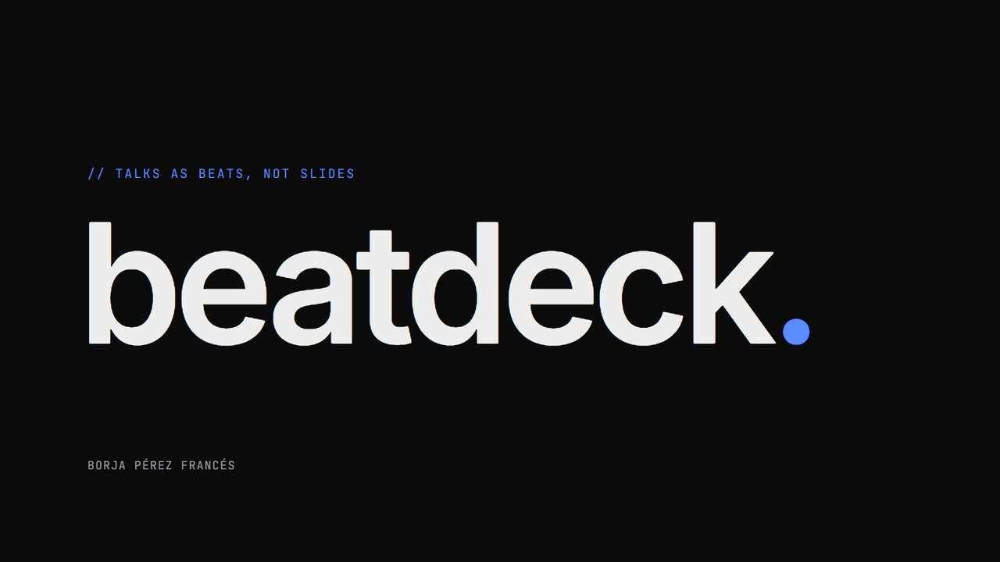
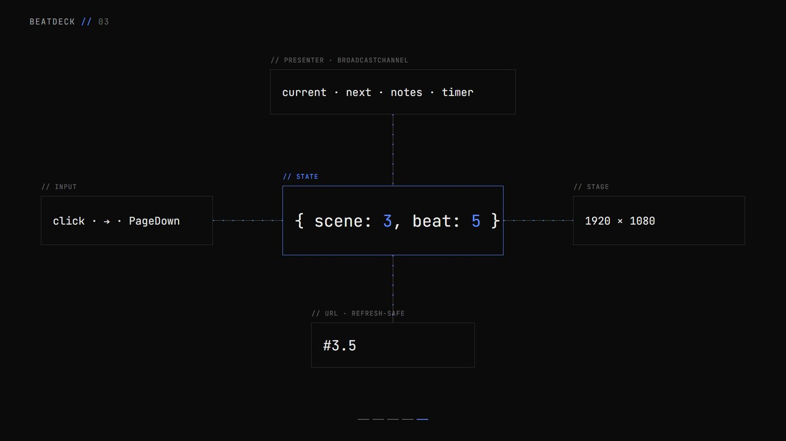
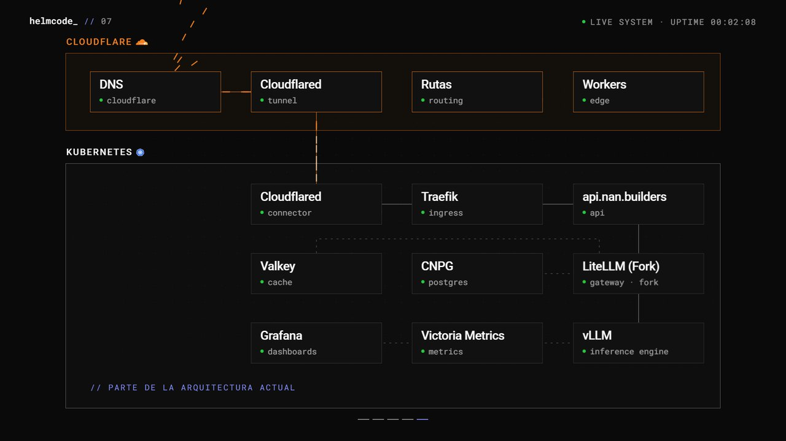

# beatdeck

**Talks as beats, not slides.** A fixed 1920×1080 React stage where one click is one beat. Motion is
authored, the state is `{ scene, beat }`, every beat rebuilds from the URL, and the build runs with Wi-Fi off.
It comes with a presenter window, an overview and a debug panel, plus a Claude Code skill that writes the talk
with you.



```bash
npx degit borjaperfra/beatdeck my-talk && cd my-talk
npm run init -- --title "My talk" --author "Your Name" --lang en   # add --theme light for bright rooms
npm install
npm run dev          # http://127.0.0.1:5173
```

`init` turns the copy into a clean talk project: it removes the showcase, the plugin files and this README,
renames the package, and writes title, author, language and theme into the deck. The demo deck stays as a
working starting point.

## Why

Slides are pages: you flip them. A talk that feels like a live system, with a diagram that grows, a counter
that runs or a crash that cuts to black, is a sequence of **beats** inside a few **scenes**. beatdeck makes
that the model:

- **One click = one beat.** Clickers (PageDown/PageUp), arrows, space, number keys and mouse all work.
- **Deterministic.** The whole state is `{ scene, beat }` plus the beat's automatic sub-state. `#3.4` in the
  URL always renders the same frame, whether you got there going forwards, going back, jumping or refreshing.
- **Automatic motion only where you want it.** A beat can run a GSAP timeline (a boot log, a counter, a
  cascade). Everything else waits for the speaker.
- **One stage.** Fixed 1920×1080, scaled with black letterbox. Nothing reflows on the projector.
- **Offline.** Fonts, images and QR codes are all bundled or computed locally. `npm run build` fails if anything
  references the network.
- **Operator tools.** A presenter window (P) with current/next beat, notes and a timer, synced over
  BroadcastChannel. An overview (O) to jump anywhere. Blackout (B). A debug panel with `?debug=1`.



## How a deck looks

```
deck/
  deck.config.ts     title, speaker, QR target, timings
  scenes.ts          the beat map: scenes → beats (+ source refs and speaker notes)
  timeline.ts        automatic beats: initialLive(pos) + timeline(pos, host)
  index.tsx          defineDeck({...}) + the Stage (layer order) + theme
  scenes/*.tsx       one layer per scene
```

```tsx
import { Reveal, Scene, useScene } from 'beatdeck';

function Idea_() {
  const { here, b } = useScene();
  return (
    <>
      <Reveal on={here} x={150} y={150}><h1 className="t-statement">Slides are pages.</h1></Reveal>
      <Reveal on={here && b >= 1} x={150} y={360}><h1 className="t-statement">Talks are beats.</h1></Reveal>
    </>
  );
}
export const Idea = () => <Scene index={1}><Idea_ /></Scene>;
```

The demo in `deck/` (5 scenes, 19 beats) uses every pattern: an automatic boot, a strike-through, a diagram
built node by node, a self-counting number, and a locally generated QR code. Replace it with your talk.

## Commands

| | |
| --- | --- |
| `npm run dev` | dev server at `http://127.0.0.1:5173/#1.1` |
| `npm run build` | typecheck + bundle + offline check → `dist/` (self-contained, any static server) |
| `npm run present` | build and open the production build locally |
| `npm run screenshots` | every beat walked and reloaded from its URL, presenter, overview → `artifacts/screenshots/`. Fails on console errors or remote requests. Needs a local Chrome. |

## Keys

→ ↓ PageDown, click, Space (fullscreen) next · ← ↑ PageUp previous · 1–9 scene · Home / End ·
F fullscreen · O overview · P presenter window · B blackout. URL flags: `?view=presenter`, `?debug=1`,
`?capture=1` (screenshots), `?reduced=1` (reduced motion).

## The skill

`skills/building-a-beatdeck/` teaches an agent the whole workflow: collect the source (it ships a PPTX
extractor), write a content audit so nothing is lost or invented, design the beat map, apply a theme, build
the scenes, then verify every beat with screenshots before calling it done.

**Claude Code** (plugin):

```
/plugin marketplace add borjaperfra/beatdeck
/plugin install beatdeck@beatdeck
```

**Any agent that reads `SKILL.md`**: copy `skills/building-a-beatdeck/` to `~/.claude/skills/` (or your
agent's skills folder). Inside a scaffolded deck it is already there, and `AGENTS.md` points to it.

Then ask for something like *"Turn talk.pptx into a beatdeck"* or *"Add a scene where the architecture grows
to three servers"*.

## Themes

`themes/neutral.css` is the default: near-black stage, off-white Inter + JetBrains Mono, one accent (`--accent`),
hairlines. `themes/light.css` is for bright rooms. To brand a deck, copy the theme and change the tokens. Fonts
must be local (`@fontsource*` packages or `.woff2` files).

## Showcase: Kernel Panic



`examples/kernel-panic/` is the production talk beatdeck was extracted from. *Escalando inferencia* by Cristian
Córdova, KERNEL PANIC #01, Madrid. It has 47 beats, a particle field that survives scene changes, an SVG
architecture that grows from one GPU to Cloudflare + Kubernetes, and a 520 ms kernel panic that cuts to
absolute black.

```bash
npm run example:kernel-panic
```

Its assets are not MIT; see [examples/kernel-panic/ASSETS-CREDITS.md](examples/kernel-panic/ASSETS-CREDITS.md).

## Stack

React 18, TypeScript, Vite, GSAP for timelines, SVG for diagrams, Canvas 2D for particles, CSS for type. No
backend, no CDN, no remote fonts. The engine is in `src/beatdeck/` and never imports from the deck.

## License

MIT for the code and docs. Third-party assets in the showcase keep their own terms.
